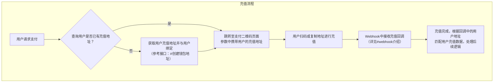

本文档将引导您完成 NUSD 平台的完整接入流程。请按照以下步骤依次操作。

## Step 1：联系我们，创建账户

在使用任何 API 之前，您需要先联系我们创建账户并获取 `wallet_id`。

1. 发送邮件至 **contact@nusdpay.com**，提供公司/项目名称、联系人信息及业务场景简述
2. 我们将为您创建钱包、绑定项目信息并分配管理员权限
3. 完成后，您将收到专属的 `wallet_id`

详细说明请参阅 [Wallet ID 申请与配置指南](/pages/domains#wallet-id-申请与配置指南)。

## Step 2：生成 API 密钥

获取 `wallet_id` 后，您需要生成 API 密钥对用于接口鉴权。

1. 按照指引生成 Ed25519 密钥对（公钥作为 `API_KEY`，私钥作为 `API_SECRET`）
2. 将公钥提供给我们进行绑定

密钥生成方法请参阅 [生成公钥和私钥](/pages/domains#生成-公钥和私钥)。

## Step 3：平台配置

根据您的业务需求，确认以下配置项。如需调整，请联系技术支持协助处理。

### 链与币种配置

选择需要开通的链及币种。平台当前支持的币种与公链详见 [支持的币种与公链](/pages/chain)。

配置完成后，您可通过以下接口查询当前已开通的链和币种：
- [获取支持的链列表](/api-reference/endpoint/chains)
- [获取支持的代币列表](/api-reference/endpoint/tokens)

### Webhook 回调配置

为实时接收充值和提现状态更新，您需要配置 Webhook 回调地址。请在申请接入时提供回调 URL，或联系技术支持进行配置。

Webhook 的详细说明请参阅 [Webhook 介绍](/pages/webhook)。

### 提币（Payout）配置

如您需要使用提币功能，请确认以下事项：
- 已开通对应链的 Payout 权限（各链支持情况请参阅 [支持的币种与公链](/pages/chain#payout-支持情况)）
- 已配置提币限额及风控规则

<Note>
配置变更请联系技术支持处理，请勿自行修改以免影响业务运行。
</Note>

## Step 4：了解请求规范

在开始调用接口前，请先阅读以下说明：
- [请求说明](/pages/request) — 请求头与身份验证
- [API 签名](/pages/encrypt) — 签名计算方式
- [交易状态说明](/pages/status) — 各状态含义
- [错误码说明](/pages/error-code) — 错误码与排查

## Step 5：接入开发

完成以上准备后，即可开始接入开发。根据您的业务场景选择对应模块：

### 充值收款

主要接口：
- [获取充值地址](/api-reference/endpoint/address)
- [查询钱包余额](/api-reference/endpoint/balance)
- [充值回调](/pages/webhook-deposit)

### 提币（Payout）

- [查询平台费用](/api-reference/endpoint/fees)
- [发起提币](/api-reference/endpoint/withdraw)
- [查询提币记录](/api-reference/endpoint/withdrawList)
- [提现回调](/pages/webhook-withdraw)

### Checkout 收银台（可选）

如需为终端用户提供支付页面，可集成 Checkout H5 页面。详见 [集成 H5 页面](/pages/checkout)。

<Note>
如您仅通过 API 进行钱包管理和资产划转，无需集成 Checkout，可跳过此部分。
</Note>