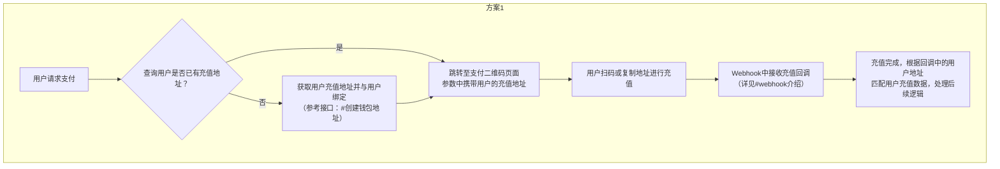

```mermaid
flowchart TD
    subgraph 方案1
        A[用户请求支付] --> B{查询用户是否已有充值地址？}
        B -->|是| C[跳转至支付二维码页面<br>参数中携带用户的充值地址]
        C --> D[用户扫码或复制地址进行充值]
        D --> E[Webhook中接收充值回调<br>（详见#webhook介绍）]
        E --> F[充值完成，根据回调中的用户地址<br>匹配用户充值数据，处理后续逻辑]

        B -->|否| G[获取用户充值地址并与用户绑定<br>（参考接口：#创建钱包地址）]
        G --> C
    end

    classDef chain fill:#eef,stroke:#55f;
```